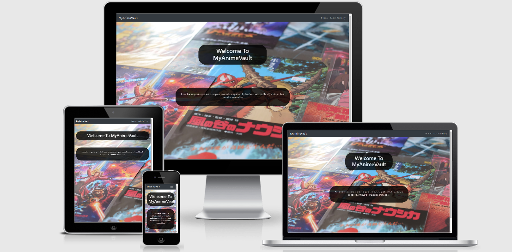
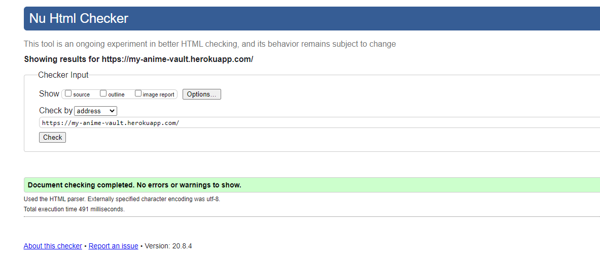
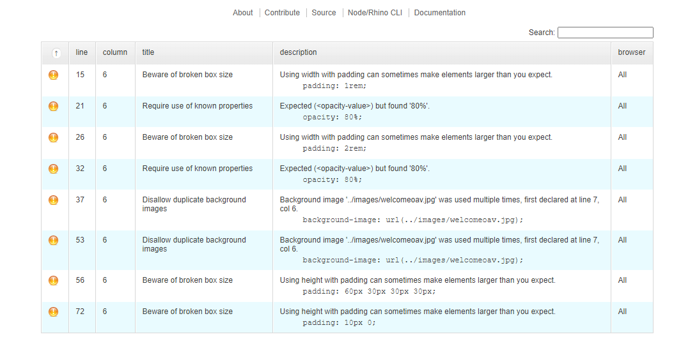

<h1>MyAnimeVault</h1>
<p>Milestone 3 Project: Data Centric Development - Code Institute<p>
<p>For my third milestone project, I choose to create an app that allowed users to share, rate, and comment about their favourite anime titles.</p>

<h2>Demo:</h2>
<p>A live demo can be found <a href="https://my-anime-vault.herokuapp.com/">here</a></p>
<p>Here is the responsiveness preview:
</p>

<h2>Introduction:</h2>
<p>Have you ever tried to remember the name of that really good anime you watched ages ago? Have you ever tried to remember what your intial thoughts on it were or all of the reasons why you liked (or disliked) it? If you're anything like me, then the answer to both of these questions is yes. That's where MyAnimeVault comes in.</p>
<p>Think of it as a very niche and collective film critiquing app for personal use. You watch an anime that you like or dislike that you might want to remember for the purposes of recommending it or rewatching it later, simply make an entry, and there you go. Your intial thoughts and feelings are recorded for reference later.<p>

<h2>Content:</h2>
<ul>
  <li>UX 👍
    <ul>
      <li>Project Goals</li>
      <li>Target Audeience Goals</li>
      <li>Site Owner Goals</li>
      <li>User Stories</li>
      <li>User Requirements and Expectations</li>
    </ul>
  </li>
  <li>Design Choices 🎨
    <ul>
      <li>Colours</li>
      <li>Background Images</li>
    </ul>
  <li>Wireframes 🔧</li>
    <ul>
      <li>Website Layout</li>
      <li>Account Creation Flowchart</li>
      <li>Database Design</li>
    </ul>
  </li>
  <li>Features 🎡
    <ul>
      <li>Features that have been developed</li>
      <li>Features that will be implemented in the future</li>
    </ul>
  </li>
  <li>Technologies Used 👨‍💻</li>
  <li>Planning + Testing ✏️ 🔌</li>
  <li>Bugs 🐞</li>
  <li>Deployment 🚀</li>
    <ul>
      <li>Deploying to Heroku</li>
      <li>Locally run this project</li>
    </ul>
  </li>
  <li>Credits 💳</li>
  <li>Disclaimer 📝</li>
</ul>

<h2>User Experience 👍</h2>
<h3>Project Goals:</h3>
<p>The goal of this project is to provide users with a online repository in which they can record their opinions of the anime titles they've seen, rating them and providing their intial thoughts. This project will serve as a collective film critiquing service for personal use that caters to a very specific genre and demographic.</p>

<h3>Target Audience Goals:</h3>
<ul>
<li>To be able to record anime titles in one place.</li>
<li>To be able to record my intial thoughts, feelings, opinion on each title.</li>
<li>To be able to rate each title.</li>
</ul>

<h3>Site Owner Goals:</h3>
<ul>
<li>Generate further interest in anime/Japanese animation</li>
<li>Encourage curiosity about the viewing habits and perspectives of others.</li>
<li>Encourage critical thinking about the anime titles that we watch, and provoke deeper exoloration of their themes, ideas, etc.</li>
<li>Collect user information for the purposes of site analytics and gaining insights into how the general public receives certain titles.</li>
</ul>

<h3>User Stories:</h3>
<ul>
<li>As a user, I expect log in to be quick and easy.</li>
<li>As a user, I expect to navigation of the site to be intuitive and require as few clicks as possible.</li>
<li>As a user, I expect to maaking an entry to be quick and simple.</li>
<li>As a user, I expect my entries to be stored in such a way that makes them easy to view and access.</li>
</ul>

<h3>User Requirements and Expectations:</h3>
<h4>Requirements:</h4>
<ul>
<li>Interact with a visually appealing website.</li>
<li>Navigate the website with ease & with fast load times.</li>
<li>Make entries in an quick and uncomplicated way.</li>
<li>Find previous entries easily and see them clearly displayed.</li>
</ul>

<h4>Expectations:</h4>
<ul>
<li>The users can interact with the elements visible on the page.</li>
<li>The website loads with sufficient speed.</li>
<li>The content on the website renders correctly on desktop, mobile and tablet.</li>
<li>The user feels satisfied with the experience.</li>
</ul>

<h2>Design Choices</h2>
<p>It was important for me to create a project aesthetic that suited the theme of Japanese anime, and so I decided to use the same template I used for my milestone 2 as a base, because it fit the theme really well. Therefore, I opted for a unifying background image that contained some popular Japanese titles. This was then framed by a dark footer and navbar, which the social media handles of the footer being pink, because when most people think of anime, they often think of either soft pastels like pink. I also opted for the accordians to be of a similar black to the footer and navbar, to provide more of a sense of cohesion. All in all, I feel all of these elements blended together in a way that appeared cohesive and seamless as well facilitated a positive user experience.</p>

<h3>Colours:</h3>
<p>I carefully considered which colours I wanted to use because I knew I wanted to mix some genre-defining pastels with some darker elements, but I also needed to ensure that the colour combinations complimeted the background image as well as each other while not overpowering one another or competing for the user's attention in jarring or dissonant way. So, after careful deliberation, I decided to use <a href="https://coolors.co/">coolers</a>, which is a colour scheme generator. It helped to experiment with dfferent palette and eventually decide on a group of colours that I think were attractive and appropriate for the project.

<h3>Background Images:</h3>
<p>The background image for this app was taken from <a href="https://unsplash.com/">Unsplash</a>.</p>

<h2>Wireframes/Flowcharts</h2>
<p>I used <a href="https://balsamiq.com/">balsamiq</a> to develop the wireframes for this project. I chose balsamiq because their process for creating wireframes is quick, simple, and intuitive. Having the wireframes developed before commencing the project made development much easier and more straightforward. It provided a basic blueprint that I could follow which made the endeavor faster and more manageable.

The wireframes can be found <a href="https://github.com/kel151/Flixlog/tree/master/wireframes">here</a>. However, certain elements of the initial wireframes were left out of the final project due to time constraints. These elements include the log-in feature and the user account page.</p>

<h3>Account Creation Flowchart:</h3>
<p>Despite the account creation and log in process seeming rather simple, I still opted to create a very basic flowchart for it for the purposes of visualizing the user's journey. It can be found <a href="https://github.com/kel151/Flixlog/tree/master/fl%20wireframes/flowcharts">here. The account creation feature was left out due to time constraints.</a></p>

<h3>Database Design:</h3>
<p>I used NoSQL features from MongoDB in order to be able to map out the collection below.</p>

<h3>Data Storage Types:</h3>
<p>The types of data that are stored in the MongoDB database:</p>
<ul>
<li>String</li>
<li>Number</li>
</ul>

Entry Collection:
**Title**|**Key in Collection**|**Data Type**
:-----:|:-----:|:-----:
Title|title|String
Category|category|String
Rating|rating|Number
Comments|comments|String

View the schema templates for the database collections <a href="https://github.com/kel151/MyAnimeVault/blob/master/data/schemas.json">here.</a>

<h2>Features</h2>

<h3>Features that have been developed:</h3>
<ul>
<li>Fixed navbar.</li>
<li>Animated social media handles.</li>
<li>Responsive accordian display of entries.</li>
</ul>

<h3>Features that will be developed in the future:</h3>
<ul>
<li>Register/create an account.</li>
<li>Log-in and log-out functionality.</li>
<li>Email authentication for added security.</li>
<li>Search bar for entries to make locating them easier when the list grows.</li>
</ul>

<h2>Technologies Used 👨‍💻</h2>
<h4>Languages:</h4>
<ul>
<li><a href="https://developer.mozilla.org/en-US/docs/Web/HTML">HTML</a></li>
<li><a href="https://developer.mozilla.org/en-US/docs/Web/CSS">CSS</a></li>
<li><a href="https://www.w3schools.com/js/">JavaScript</a></li>
<li><a href="https://www.json.org/json-en.html">JSON</a></li>
<li><a href="https://www.python.org/">Python</a></li>
</ul>

<h4>Tools & Libraries:</h4>
<ul>
<li><a href="https://jquery.com/">jQuery</a></li>
<li><a href="https://git-scm.com/">Git</a></li>
<li><a href="https://getbootstrap.com/">Bootstrap</a></li>
<li><a href="https://www.mongodb.com/cloud/atlas">MongoDB Atlas</a></li>
<li><a href="https://pymongo.readthedocs.io/en/stable/">PyMongo</a></li>
<li><a href="https://flask.palletsprojects.com/en/1.0.x/">Flask</a></li>
<li><a href="https://jinja.palletsprojects.com/en/2.10.x/">Jinja</a></li>
<li><a href="https://www.heroku.com/">Heroku</a></li>
<li><a href="https://coolors.co/">Coolers</a></li>
</ul>

<h2>Planning + Testing</h2>

<h4>Planning:</h4>
<p>Planning for this was relatively smooth because I had a clear idea of what I wanted to achieve before starting it. However, I ran into a few difficulties, the main one being time constraints. Therefore, I couldn't include as many features as I planned to.</p>

<h4>Testing:</h4>
<p>I used a combination of DevTools and <a href="http://ami.responsivedesign.is/">Am I Responsive?</a> to test the responsiveness of the app on devices of differetnet sizes and makes. I also provided a link to the app to family and friends so as to receive firsthand feedback as to how responsive the app truly was. I received no complaints. An example of the responsiveness can be viewed in the first image at the beginning of this ReadMe.</p>
 
<p>I tested the navbar and it works as intended. It's fixed and the links bring you to the relevant pages.<p>
<p>I tested the social media handles. Their animations work and they bring you to the relevant pages.<p>
<p>I tested the <a href="https://en.wikipedia.org/wiki/Create,_read,_update_and_delete">CRUD</a> functionality and it works as intended. Users are able to create an entry, view entries, edit entries, and delete entries.<p>

<p>I used <a href="https://validator.w3.org/">Code Verifier</a>, and found no errors:
</p>

<p>I used <a href="http://pep8online.com/">PEP8</a>, and found a few errors, the majority being to do with spacing. However, I prefer this spacing as I feel it makes the code a little neater:
</p>

<p>I used <a href="http://csslint.net/">CCSSLint</a>, and found the following errors and warnings:
</p>

<h2>Deployment</h2>
<p>MyAnimeVault was developed on Gitpod, using git and Github to host.</p>

<h3>Cloning MyAnimeVault from Github:</h3>

<p>You will need to install the following:</p>

<ul>
<li><a href="https://pip.pypa.io/en/stable/installing/">PIP</a></li>
<li><a href="https://www.python.org/">Python</a></li>
<li><a href="https://git-scm.com/">Git</a></li>
</ul>

<p>You will also need a <a href="https://www.mongodb.com/">MongoDB</a> account for the databsae.<p>

<em>WARNING: You may need to follow a different guide based on the OS you are using, read more <a href="https://python.readthedocs.io/en/latest/library/venv.html">here.</a></em>

* 1: <strong>Clone</strong> the MyAnimeVault repository by either downloading from <a href="https://github.com/kel151/MyAnimeVault"> here</a>, or if you have Git installed typing the following command into your terminal.
```bash
git clone https://github.com/kel151/MyAnimeVault
```
* 2: <strong>Navigate</strong> to this folder in your terminal.
* 3: <strong>Enter</strong> the following command into your terminal.
```bash
python3 -m .venv venv
```
* 4: <strong>Initilaize</strong> the environment by using the following command.
```bash
.venv\bin\activate 
```
* 5: <strong>Install</strong> the relevant requirements & dependancies from the requirements.txt file.
```bash
pip3 -r requirements.txt
```
* 6: In your IDE now <strong>create</strong> a file where you can store your SECRET_KEY and your MONGO_URI, follow the schema structure located in data/schemas to properly setup the Mongo Collections.

* 7: Run the application using 
```bash
flask run 
```
or 
```bash
Python3 app.py
```
<h3>Deploying MyAnimeVault to Heroku:</h3>

* 1: <strong>Create</strong> a requirements.txt file using the following command.
```bash
pip3 freeze > requirements.txt
```
* 2: <strong>Create</strong> a Procfile with the following command.
```bash
echo web: python3 app.py > Procfile
```
* 3: <strong>Push</strong> these newly created files to your repository.
* 4: <strong>Create</strong> a new app for this project on the Heroku Dashboard.
* 5: <strong>Select</strong> your <strong>deployment</strong> method by clicking on the <strong>deployment</strong> method button and select GitHub.
* 6: On the dashboard, <strong>set</strong> the following config variables:

**Key**|**Value**
:-----:|:-----:
IP|0.0.0.0
PORT|8080
MONGO\_URI|mongodb+srv://<username>:<password>@<cluster\_name>-qtxun.mongodb.net/<database\_name>?retryWrites=true&w=majority
SECRET\_KEY|"your\_secret\_key"
* 7: Click the deploy button on the Heroku dashboard.
* 8: The site has been deployed the Heroku.


<h2>Credits</h2>
<h3>Media</h3>
<p>The images used in this project were taken from <a href="https://unsplash.com//">Unsplash</a>, an open license and highly customizable resource that I greatly recommend.</p>
<h3>Acknowledgements</h3>
<ul>
 <li>My mentor, Simen, for all of his patience, advice, and recommendations.</li>
 <li>The Code Institute Slack Community for all of their advice, kindness, and encouragement.</li>
 <li>The Student Care team for the constant support, encouragement, and check-in messages.</li>
 <li>Claire Lally from the Student Care Team who has been staunch supporter and a source of light and inspiration during this process.</li>
 <li>The Code Insitute tutoring team (particularly Samantha, Scott, Xavier, and Tim) for their patience and perpetual willingness to help, no matter how late.</li>
 <li>Michael from the tutoring team who stayed up with me many a late night to help. I wouldn't know as much as I do now without his patient and effective guidance.</li>
 <li>My classmate Sebastien Denommee for all of his support and advice on improving my work.</li>
 <li>George Pyott for his help in improving my ReadMe, the example he set was instrumental.</li>
</ul>
<h2>Disclaimer</h2>
<p>The contents of this website are for educational purposes only.</p>
